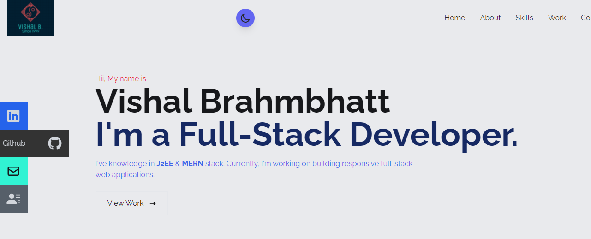

# Personal Portfolio

I've created Personal Portfolio site with help of React and tailwind CSS. Also, implemented contact me feature with help of GitForm.io.
#### Please check out Live website here : 
 
 
Please check out below screenshots for better understanding.

## Screenshots

- Home

### Technologies used :

 - React
 - HTML/ tailwind CSS
 - States / GitForms
 
